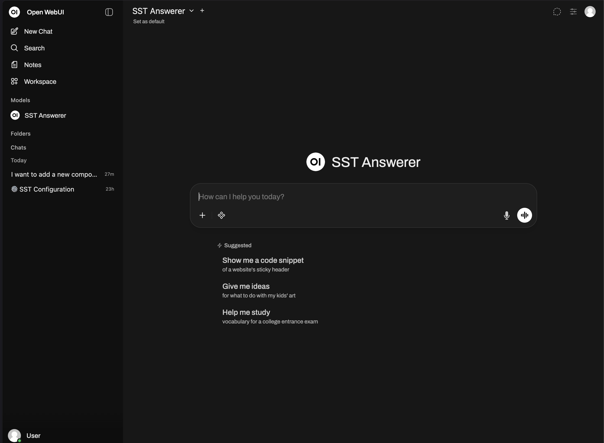
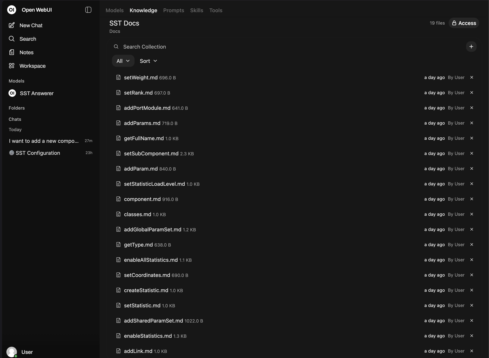
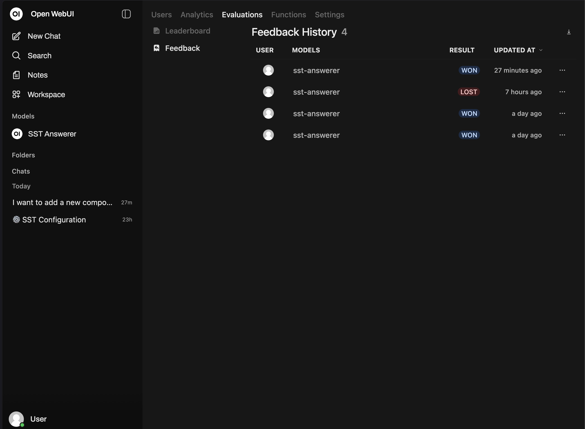

# AI DocOps for SST: An Answerer and Gap Tracker

This demo gives SST model developers and users one place to ask questions
about SST documentation and source code. Answers include clickable citations.
If the available evidence comes only from source code, the Answerer says so
and records a likely documentation gap. If neither collection supports an
answer, it returns an honest not-found response.

The Gap Tracker turns those outcomes and user ratings into a grouped
maintainer report. It does not edit documentation or open issues unless a
maintainer explicitly runs the publish command.

Inference runs locally through
[llama.cpp](https://github.com/ggml-org/llama.cpp). The demo supports Apple
Metal, NVIDIA CUDA, and AMD ROCm.
Initial setup downloads images and model files. Once running, the Answerer
does not send prompts or retrieved SST content to a cloud model.

<table>
<tr>
<td></td>
<td></td>
<td></td>
</tr>
</table>

## Quick start

You need Podman or Docker with Compose and enough memory to run a 14B
quantized model. GPU requirements are:

| Platform | Host requirement |
|---|---|
| macOS | Apple Silicon, Xcode Command Line Tools, and CMake |
| NVIDIA Linux | `nvidia-container-toolkit` and a generated CDI device |
| AMD Linux | ROCm and membership in the `video` and `render` groups |

One-time Linux setup:

```bash
# NVIDIA with Podman
sudo nvidia-ctk cdi generate --output=/etc/cdi/nvidia.yaml

# AMD; log out and back in afterward
sudo usermod -aG video,render "$USER"
```

Copy the example configuration, then set `PLATFORM`. The versioned demo image
is already configured:

```bash
cp .env.example .env

# Edit .env:
# PLATFORM=mac            # mac, nvidia, or amd
```

Download the three model files:

```bash
curl -L \
  "https://huggingface.co/MaziyarPanahi/Qwen3-14B-GGUF/resolve/main/Qwen3-14B.Q4_K_M.gguf" \
  -o models/Qwen3-14B-Q4_K_M.gguf

curl -L \
  "https://huggingface.co/nomic-ai/nomic-embed-text-v1.5-GGUF/resolve/main/nomic-embed-text-v1.5.Q8_0.gguf" \
  -o models/nomic-embed-text-v1.5.Q8_0.gguf

curl -L \
  "https://huggingface.co/gpustack/bge-reranker-v2-m3-GGUF/resolve/main/bge-reranker-v2-m3-Q8_0.gguf" \
  -o models/bge-reranker-v2-m3-Q8_0.gguf
```

Start the demo:

```bash
./start.sh
```

Open <http://localhost:3000>. Stop it with:

```bash
./stop.sh
```

`start.sh` checks the model files, pulls `DEMO_IMAGE` when needed, starts the
three local model endpoints, and waits for Open WebUI. On macOS, it offers to
build `llama.cpp` if `llama-server` is unavailable.

The UI binds to `127.0.0.1` because this demo disables authentication. Do not
expose it on `0.0.0.0` without adding authentication and an authenticated
reverse proxy.

## What the Answerer reports

| Retrieved support | Answer shown to the user | Recorded outcome |
|---|---|---|
| Relevant SST documentation | Cited answer | `adequate_docs` |
| Relevant SST source code only | Cited answer with a source-only notice | `source_only` and `doc_gap_source_only` |
| No relevant documentation or source | Exact not-found response | `total_gap` and `doc_gap_no_answer` |

The documentation and source code are separate Open WebUI knowledge
collections. The answer filter checks the citations and reranker scores
already produced by Open WebUI. It does not make another model call or perform
another search.

Chats, ratings, and outcome events remain under `runtime-data/`. This
directory survives restarts. To test a newly pulled image without replacing
existing runtime data:

```bash
RUNTIME_DATA_DIR=./runtime-data-clean ./start.sh
```

## Run the Gap Tracker

Ask and rate a few questions in the UI, then run:

```bash
./gap-tracker.sh collect
./gap-tracker.sh report
./gap-tracker.sh publish --dry-run
```

The wrapper creates an ignored Python environment on first use. `collect`
reads `runtime-data/gap_log.jsonl` and exports thumbs-up/down feedback from
Open WebUI. `report` computes answer outcomes and groups related gaps.
`publish --dry-run` previews the Markdown report, metrics, and optional GitHub
issue without writing or posting anything.

See [gap-tracker/README.md](gap-tracker/README.md) for collection windows,
configuration, event format, and GitHub publishing.

## Architecture

```text
Question
  └─ Open WebUI retrieval and reranking
       └─ local chat model
            └─ citation and source check
                 ├─ cited documentation answer
                 ├─ cited source-only answer + gap event
                 └─ honest not-found response + gap event

Gap events + ratings
  └─ collect
       └─ group related questions
            └─ Markdown report + optional GitHub issue
```

| Port | Service |
|---|---|
| `3000` | Open WebUI |
| `8000` | Chat model |
| `8001` | Embedding model |
| `8002` | Reranker |

The model ports are host-local on macOS and internal to the Compose stack on
NVIDIA and AMD systems.

## Maintainer workflows

Generated Open WebUI databases, uploaded corpus files, and vectors are not
stored in Git. Downloadable releases use a prebuilt image. The repository
keeps the scripts and a compact lock containing the indexed SST repository
revisions and collection counts.

Use [seed/README.md](seed/README.md) to:

- refresh the image from newer `sst-docs`, `sst-core`, and `sst-elements`
  revisions;
- resume an interrupted refresh;
- build and validate a seeded image;
- make a configuration-only seed change; or
- try the Answerer filter manually with another documentation/source corpus.

The automated refresh is intentionally SST-specific. It reviews the SST
question bank, builds replacement collections in a staging copy, validates
the result, and replaces the known-good seed only after the full refresh
succeeds.

## Checks

Run the repository checks from the project root:

```bash
python3 -m unittest discover -s tests -v
python3 scripts/audit_question_bank.py
python3 scripts/audit_public_release.py
bash seed/build.sh --check
```

Run the Gap Tracker suite separately:

```bash
cd gap-tracker
python3 -m venv .venv
.venv/bin/python -m pip install -r requirements.lock pytest==9.1.1
.venv/bin/python -m pip install --no-build-isolation --no-deps -e .
.venv/bin/python -m pytest tests -q
```

`seed/build.sh --check` requires a generated maintainer seed, which is ignored
by Git. End users running a published image do not need that directory.

This project is licensed under Apache-2.0. See [LICENSE](LICENSE).
